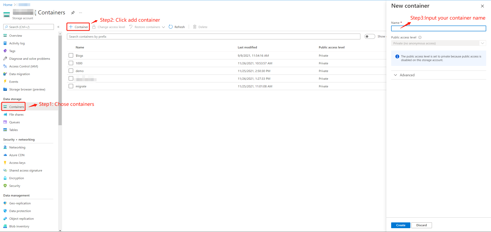
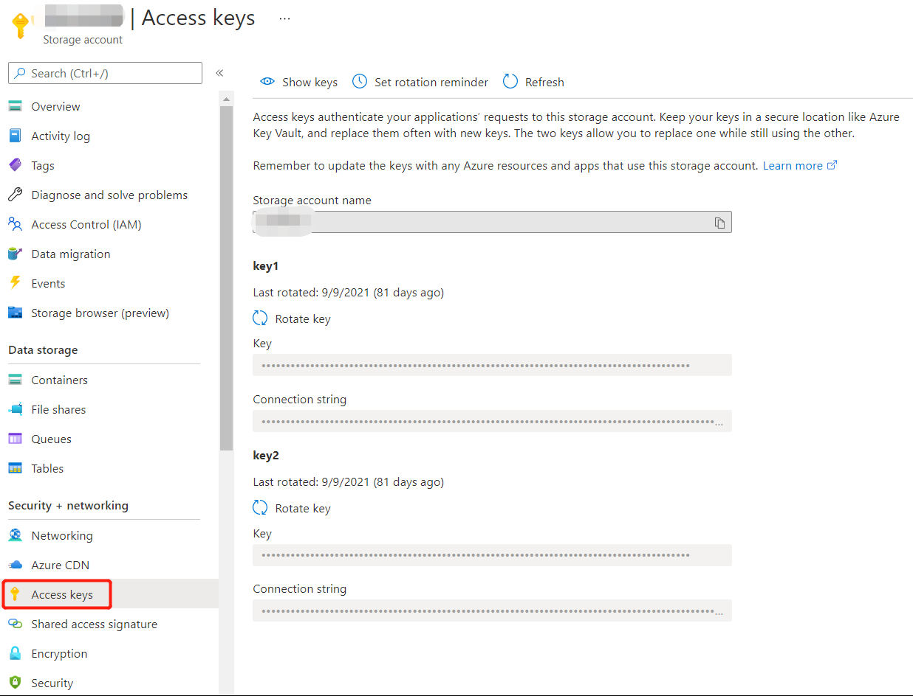

<!--
 - Licensed to the Apache Software Foundation (ASF) under one or more
 - contributor license agreements.  See the NOTICE file distributed with
 - this work for additional information regarding copyright ownership.
 - The ASF licenses this file to You under the Apache License, Version 2.0
 - (the "License"); you may not use this file except in compliance with
 - the License.  You may obtain a copy of the License at
 -
 -   http://www.apache.org/licenses/LICENSE-2.0
 -
 - Unless required by applicable law or agreed to in writing, software
 - distributed under the License is distributed on an "AS IS" BASIS,
 - WITHOUT WARRANTIES OR CONDITIONS OF ANY KIND, either express or implied.
 - See the License for the specific language governing permissions and
 - limitations under the License.
 -->

# Kyuubi On Delta Lake With Microsoft Azure Blob Storage

## Microsoft Azure Registration And Configuration
#### Register A Microsoft Azure Account And Log In
Regarding the Microsoft Azure account, please contact your organization or register an account as an individual. For details, please refer to the [Microsoft Azure official website](https://azure.microsoft.com/en-gb/).

#### Create Microsoft Azure Storage Container
After logging in with your Microsoft Azure account, please follow the steps below to create a data storage container:


#### Get Microsoft Azure Access Key


## Deploy Spark
#### Download Spark Package
Download spark package that matches your environment from [spark official website](https://spark.apache.org/downloads.html). And then unpackage:
```shell
tar -xzvf spark-3.2.0-bin-hadoop3.2.tgz
```

#### Config Spark
Enter the ./spark/conf directory and execute:
```shell
cp spark-defaults.conf.tmp spark-defaults.conf
```

Add following configuration to spark-defaults.conf, please refer to your own local configuration for specific personalized configuration:
```text
spark.master                     spark://<YOUR_HOST>:7077 
spark.sql.extensions             io.delta.sql.DeltaSparkSessionExtension
spark.sql.catalog.spark_catalog  org.apache.spark.sql.delta.catalog.DeltaCatalog
```
Create a new file named core-site.xml under ./spark/conf directory, and add following configuration:
```xml
<?xml version="1.0" encoding="UTF-8"?>
<?xml-stylesheet type="text/xsl" href="configuration.xsl"?>
<configuration>
<property>
    <name>fs.AbstractFileSystem.wasb.Impl</name>
    <value>org.apache.hadoop.fs.azure.Wasb</value>
 </property>
 <property>
  <name>fs.azure.account.key.YOUR_AZURE_ACCOUNT.blob.core.windows.net</name>
  <value>YOUR_AZURE_ACCOUNT_ACCESS_KEY</value>
 </property>
 <property>
    <name>fs.azure.block.blob.with.compaction.dir</name>
    <value>/hbase/WALs,/tmp/myblobfiles</value>
 </property>
 <property>
    <name>fs.azure</name>
    <value>org.apache.hadoop.fs.azure.NativeAzureFileSystem</value>
 </property>
<property>
    <name>fs.azure.enable.append.support</name>
    <value>true</value>
 </property>
</configuration>
```
#### Copy Dependencies To Spark
Copy jar packages required by delta lake and microsoft azure to ./spark/jars directory:
```shell
wget https://repo1.maven.org/maven2/io/delta/delta-core_2.12/1.0.0/delta-core_2.12-1.0.0.jar -O ./spark/jars/delta-core_2.12-1.0.0.jar

wget https://repo1.maven.org/maven2/com/microsoft/azure/azure-storage/8.6.6/azure-storage-8.6.6.jar -O ./spark/jars/azure-storage-8.6.6.jar

wget https://repo1.maven.org/maven2/com/azure/azure-storage-blob/12.14.2/azure-storage-blob-12.14.2.jar -O ./spark/jars/azure-storage-blob-12.14.2.jar

wget https://repo1.maven.org/maven2/org/apache/hadoop/hadoop-azure/3.1.1/hadoop-azure-3.1.1.jar -O ./spark/jars/hadoop-azure-3.1.1.jar
```
#### Start Spark
```shell
./spark/sbin/start-master.sh -h <YOUR_HOST> -p 7077 --webui-port 9090

./spark/sbin/start-worker.sh spark://<YOUR_HOST>:7077
```

#### Test The connectivity Of Spark And Delta Lake
Start spark shell:
```shell
/usr/apache/current/spark/bin> ./spark-shell
Using Spark's default log4j profile: org/apache/spark/log4j-defaults.properties
Setting default log level to "WARN".
To adjust logging level use sc.setLogLevel(newLevel). For SparkR, use setLogLevel(newLevel).
Spark context Web UI available at http://HOST:4040
Spark context available as 'sc' (master = spark://HOST:7077, app id = app-20211126172803-0003).
Spark session available as 'spark'.
Welcome to
      ____              __
     / __/__  ___ _____/ /__
    _\ \/ _ \/ _ `/ __/  '_/
   /___/ .__/\_,_/_/ /_/\_\   version 3.1.2
      /_/

Using Scala version 2.12.10 (OpenJDK 64-Bit Server VM, Java 1.8.0_302)
Type in expressions to have them evaluated.
Type :help for more information.

scala>

```
Generate a piece of random data and push them to delta lake:
```shell
scala> val data = spark.range(1000, 2000)
scala> data.write.format("delta").mode("overwrite").save("wasbs://<YOUR_CONTAINER_NAME>@<YOUR_AZURE_ACCOUNT>.blob.core.windows.net/<YOUR_TABLE_NAME>")
```
After this, you can check your data on azure web UI. For example, my container name is 1000 and table name is alexDemo20211127:


You can also check data by reading back the data from delta lake:
```shell
scala> val df=spark.read.format("delta").load("wasbs://<YOUR_CONTAINER_NAME>@<YOUR_AZURE_ACCOUNT>.blob.core.windows.net/<YOUR_TABLE_NAME>")
scala> df.show()
+----+
|  id|
+----+
|1000|
|1001|
|1002|
|1003|
|1004|
|1005|
|1006|
|1007|
|1008|
|1009|
|1010|
|1011|
|1012|
|1013|
|1014|
|1015|
|1016|
|1017|
|1018|
|1019|
+----+
only showing top 20 rows
```
If there is no problem with the above, it proves that spark has been built with delta lake.

## Deploy Kyuubi
#### Install Kyuubi
1.Download the latest version of [kyuubi](https://kyuubi.apache.org/releases.html).

2.Unpackage
```shell
tar -xzvf  apache-kyuubi-1.3.1-incubating-bin.tgz
```
#### Config Kyuubi
Enter the ./kyuubi/conf directory
```shell
cp kyuubi-defaults.conf.template kyuubi-defaults.conf
vim kyuubi-defaults.conf
```

Add the following content:
```text
spark.master                    spark://<YOUR_HOST>:7077
kyuubi.authentication           NONE
kyuubi.frontend.bind.host       <YOUR_HOST>
kyuubi.frontend.bind.port       10009
# If you use your own zk cluster, you need to configure your zk host port.
# kyuubi.ha.zookeeper.quorum    <YOUR_HOST>:2181 
```

#### Start Kyuubi
```shell
/usr/apache/current/kyuubi/bin> kyuubi start
Starting Kyuubi Server from /usr/apache/current/kyuubi
Warn: Not find kyuubi environment file /usr/apache/current/kyuubi/conf/kyuubi-env.sh, using default ones...
JAVA_HOME: /usr/lib64/jvm/java
KYUUBI_HOME: /usr/apache/current/kyuubi
KYUUBI_CONF_DIR: /usr/apache/current/kyuubi/conf
KYUUBI_LOG_DIR: /usr/apache/current/kyuubi/logs
KYUUBI_PID_DIR: /usr/apache/current/kyuubi/pid
KYUUBI_WORK_DIR_ROOT: /usr/apache/current/kyuubi/work
SPARK_HOME: /usr/apache/current/spark
SPARK_CONF_DIR: /usr/apache/current/spark/conf
HADOOP_CONF_DIR:
YARN_CONF_DIR:
Starting org.apache.kyuubi.server.KyuubiServer, logging to /usr/apache/current/kyuubi/logs/kyuubi-hadoop-org.apache.kyuubi.server.KyuubiServer-host.out
Welcome to
  __  __                           __
 /\ \/\ \                         /\ \      __
 \ \ \/'/'  __  __  __  __  __  __\ \ \____/\_\
  \ \ , <  /\ \/\ \/\ \/\ \/\ \/\ \\ \ '__`\/\ \
   \ \ \\`\\ \ \_\ \ \ \_\ \ \ \_\ \\ \ \L\ \ \ \
    \ \_\ \_\/`____ \ \____/\ \____/ \ \_,__/\ \_\
     \/_/\/_/`/___/> \/___/  \/___/   \/___/  \/_/
                /\___/
                \/__/
```

Check kyuubi log, in order to check kyuubi start status and find the jdbc connection url:
```shell
2021-11-26 17:49:50.227 INFO server.KyuubiServer: Service[KyuubiServer] is initialized.
2021-11-26 17:49:50.229 INFO service.KinitAuxiliaryService: Service[KinitAuxiliaryService] is started.
2021-11-26 17:49:50.230 INFO metrics.JsonReporterService: Service[JsonReporterService] is started.
2021-11-26 17:49:50.230 INFO metrics.MetricsSystem: Service[MetricsSystem] is started.
2021-11-26 17:49:50.234 INFO zookeeper.ClientCnxn: Socket connection established to host/*.*.*.*:2181, initiating session
2021-11-26 17:49:50.234 INFO operation.KyuubiOperationManager: Service[KyuubiOperationManager] is started.
2021-11-26 17:49:50.234 INFO session.KyuubiSessionManager: Service[KyuubiSessionManager] is started.
2021-11-26 17:49:50.234 INFO server.KyuubiBackendService: Service[KyuubiBackendService] is started.
2021-11-26 17:49:50.235 INFO service.ThriftFrontendService: Service[ThriftFrontendService] is started.
2021-11-26 17:49:50.235 INFO service.ThriftFrontendService: Starting and exposing JDBC connection at: jdbc:hive2://HOST:10009/
2021-11-26 17:49:50.239 INFO zookeeper.ClientCnxn: Session establishment complete on server host/*.*.*.*:2181, sessionid = 0x100046ec0ca01b5, negotiated timeout = 40000
2021-11-26 17:49:50.245 INFO state.ConnectionStateManager: State change: CONNECTED
2021-11-26 17:49:50.247 INFO client.KyuubiServiceDiscovery: Zookeeper client connection state changed to: CONNECTED
2021-11-26 17:49:50.265 INFO client.ServiceDiscovery: Created a /kyuubi/serviceUri=host:10009;version=1.3.1-incubating;sequence=0000000037 on ZooKeeper for KyuubiServer uri: host:10009
2021-11-26 17:49:50.266 INFO client.KyuubiServiceDiscovery: Service[KyuubiServiceDiscovery] is started.
2021-11-26 17:49:50.267 INFO server.KyuubiServer: Service[KyuubiServer] is started.
```
You can get the jdbc connection url by the log:
```shell
2021-11-26 17:49:50.235 INFO service.ThriftFrontendService: Starting and exposing JDBC connection at: jdbc:hive2://HOST:10009/
```
#### Test The Connectivity Of Kyuubi And Delta Lake
```shell
/usr/apache/current/spark/bin> ./beeline -u 'jdbc:hive2://<YOUR_HOST>:10009/'
log4j:WARN No appenders could be found for logger (org.apache.hadoop.util.Shell).
log4j:WARN Please initialize the log4j system properly.
log4j:WARN See http://logging.apache.org/log4j/1.2/faq.html#noconfig for more info.
Connecting to jdbc:hive2://HOST:10009/
Connected to: Spark SQL (version 1.3.1-incubating)
Driver: Hive JDBC (version 2.3.7)
Transaction isolation: TRANSACTION_REPEATABLE_READ
Beeline version 2.3.7 by Apache Hive
0: jdbc:hive2://YOUR_HOST>
```
At the same time, you can also check whether the engine is running on the spark UI:


When the engine started, it will expose a thrift endpoint and register itself into ZooKeeper, Kyuubi server can get the connection info from ZooKeeper and establish the connection to the engine.
So, you can check the registration details in zookeeper path ’/kyuubi_USER/anonymous‘.

## Dealing Delta Lake Data By Using Kyuubi Examples
Operate delta-lake data through SQL:  
1.Create Table
```sql
-- Create or replace table with path
CREATE OR REPLACE TABLE delta.`wasbs://1000@azure_account.blob.core.windows.net/alexDemo20211129` (
  date DATE,
  eventId STRING,
  eventType STRING,
  data STRING)
USING DELTA
PARTITIONED BY (date);
```
2.Insert Data  
Append Mode:
```sql
INSERT INTO delta.`wasbs://1000@azure_account.blob.core.windows.net/alexDemo20211129` (
    date,
    eventId,
    eventType,
    data)
VALUES 
    (now(),'001','test','Hello World!'),
    (now(),'002','test','Hello World!'),
    (now(),'003','test','Hello World!');
```
Result:
```shell
+-------------+----------+------------+---------------+
|    date     | eventId  | eventType  |     data      |
+-------------+----------+------------+---------------+
| 2021-11-29  | 001      | test       | Hello World!  |
| 2021-11-29  | 003      | test       | Hello World!  |
| 2021-11-29  | 002      | test       | Hello World!  |
+-------------+----------+------------+---------------+
```
Overwrite Mode:
```sql
INSERT OVERWRITE TABLE delta.`wasbs://1000@azure_account.blob.core.windows.net/alexDemo20211129`(
    date,
    eventId,
    eventType,
    data)
VALUES 
(now(),'001','test','hello kyuubi'),
(now(),'002','test','hello kyuubi');
```
Result:
```shell
+-------------+----------+------------+---------------+
|    date     | eventId  | eventType  |     data      |
+-------------+----------+------------+---------------+
| 2021-11-29  | 002      | test       | hello kyuubi  |
| 2021-11-29  | 001      | test       | hello kyuubi  |
+-------------+----------+------------+---------------+
```
Delete Table Data:
```sql
delete from delta.`wasbs://1000@azure_account.blob.core.windows.net/alexDemo20211129` where eventId = 002;
```
Result:
```shell
+-------------+----------+------------+---------------+
|    date     | eventId  | eventType  |     data      |
+-------------+----------+------------+---------------+
| 2021-11-29  | 001      | test       | hello kyuubi  |
+-------------+----------+------------+---------------+
```

Update table data:
```sql
UPDATE delta.`wasbs://1000@azure_account.blob.core.windows.net/alexDemo20211129`
SET data = 'This is a test for update data.'
WHERE eventId = 001;
```
Result:
```text
+-------------+----------+------------+----------------------------------+
|    date     | eventId  | eventType  |               data               |
+-------------+----------+------------+----------------------------------+
| 2021-11-29  | 001      | test       | This is a test for update data.  |
+-------------+----------+------------+----------------------------------+
```

Select table data:
```sql
SELECT * FROM delta.`wasbs://1000@azure_account.blob.core.windows.net/alexDemo20211129`;
```
Result:
```text
+-------------+----------+------------+----------------------------------+
|    date     | eventId  | eventType  |               data               |
+-------------+----------+------------+----------------------------------+
| 2021-11-29  | 001      | test       | This is a test for update data.  |
+-------------+----------+------------+----------------------------------+
```

## References
- [https://delta.io/](https://delta.io/)
- [https://docs.delta.io/latest/delta-batch.html#-ddlcreatetable](https://docs.delta.io/latest/delta-batch.html#-ddlcreatetable)
- [https://spark.apache.org/docs/latest/](https://spark.apache.org/docs/latest/)
- [https://docs.microsoft.com/en-us/azure/databricks/delta/quick-start](https://docs.microsoft.com/en-us/azure/databricks/delta/quick-start)

