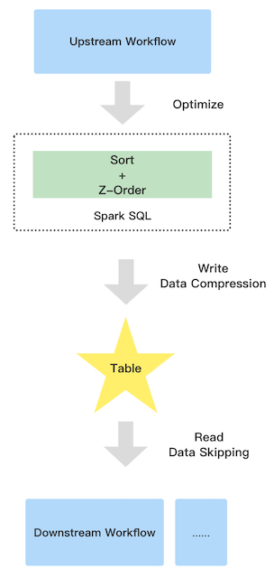

<!--
 - Licensed to the Apache Software Foundation (ASF) under one or more
 - contributor license agreements.  See the NOTICE file distributed with
 - this work for additional information regarding copyright ownership.
 - The ASF licenses this file to You under the Apache License, Version 2.0
 - (the "License"); you may not use this file except in compliance with
 - the License.  You may obtain a copy of the License at
 -
 -   http://www.apache.org/licenses/LICENSE-2.0
 -
 - Unless required by applicable law or agreed to in writing, software
 - distributed under the License is distributed on an "AS IS" BASIS,
 - WITHOUT WARRANTIES OR CONDITIONS OF ANY KIND, either express or implied.
 - See the License for the specific language governing permissions and
 - limitations under the License.
 -->

<div align=center>


</div>

# Z-order introduction

## Introduction

Let describe the picture shows the workflow of z-order.



### Supported table format

| Table Format | Supported |
|--------------|-----------|
| parquet      |     Y     |
| orc          |     Y     |
| json         |     N     |
| csv          |     N     |
| text         |     N     |

### Supported column data type

| Column Data Type | Supported |
|------------------|-----------|
| byte             |     Y     |
| short            |     Y     |
| int              |     Y     |
| long             |     Y     |
| float            |     Y     |
| double           |     Y     |
| boolean          |     Y     |
| string           |     Y     |
| decimal          |     Y     |
| date             |     Y     |
| timestamp        |     Y     |
| array            |     N     |
| map              |     N     |
| struct           |     N     |
| udt              |     N     |

## How to use

This feature is inside Kyuubi extension, so you should apply the extension to Spark by following steps.

- add extension jar: `copy $KYUUBI_HOME/extension/kyuubi-extension-spark-3-1* $SPARK_HOME/jars/`
- add config into `spark-defaults.conf`: `spark.sql.extensions=org.apache.kyuubi.sql.KyuubiSparkSQLExtension`

Due to the extension, z-order only works with Spark-3.1 and higher version.

### Optimize history data

If you want to optimize the history data of a table, the `OPTIMIZE ...` syntax is good to go. Due to Spark SQL doesn't support read and overwrite same datasource table, the syntax can only support to optimize Hive table.

#### Syntax
```sql
OPTIMIZE table_name [WHERE predicate] ZORDER BY col_name1 [, ...]
```

Note that, the `predicate` only supports partition column.

#### Examples
```sql
OPTIMIZE t1 ZORDER BY c3;

OPTIMIZE t1 ZORDER BY c1,c2;

OPTIMIZE t1 WHERE day = '2021-12-01' ZORDER BY c1,c2;
```

### Optimize incremental data

Kyuubi supports optimize a table automatically for incremental data. e.g., time partitioned table. The only things you need to do is adding Kyuubi properties into the target table properties:
```sql
ALTER TABLE t1 SET TBLPROPERTIES('kyuubi.zorder.enabled'='true','kyuubi.zorder.cols'='c1,c2');
```
- the key `kyuubi.zorder.enabled` decide if the table allows Kyuubi to optimize by z-order.
- the key `kyuubi.zorder.cols` decide which columns are used to optimize by z-order.

Kyuubi will detect the properties and optimize SQL using z-order during SQL compilation, so you can enjoy z-order with all writing table command like:

```sql
INSERT INTO TABLE t1 PARTITION() ...;

INSERT OVERWRITE TABLE t1 PARTITION() ...;

CREATE TABLE t1 AS SELECT ...;
```
